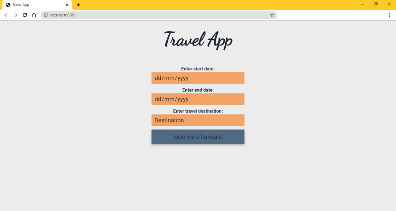
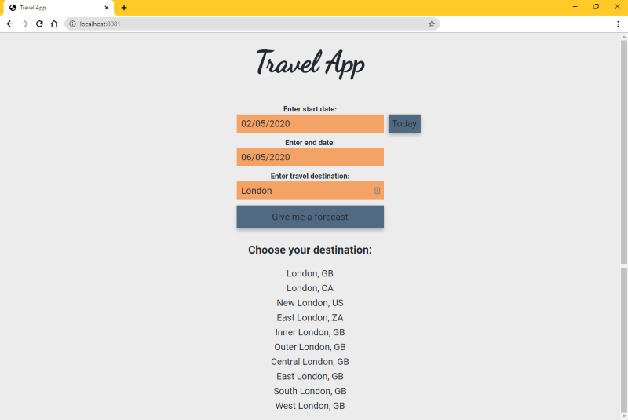

# Travel App Project

## Overview

This is the last project for Udacity's Front End Developer Nanodegree Program, a Travel App.

## To get started

- clone project with `https://github.com/susumoa/travel-app.git`
- `cd` into the new `travel-app` folder
- run `npm install`
- run `touch .env`
- add your API ID and API KEY to the `.env` file like this:
  ```
  WEATHER_API_KEY=="*************************"
  IMG_API_KEY="*************************"
  ```
- run `npm run build-prod`
- start the server with `npm run start`
- open `localhost:8080` in your browser or run `npm run build-dev`

## How to use

### Input field



On mobile:


Enter your travel destination, start and end date and click the Give me a forecast button. The date input fields only allow the format DD/MM/YYYY. Giving invalid input in the date or destination field invokes an alert.

If your start date is today, you can click the Today button next to the start date input field, instead of typing.

#### In the background

When clicking the submit buttont the dateChecker function checks if the date is valid and the end date is later or on the same day as the start date. It can take leap years in account.
Then an API call to Geonames fetches an object that contains a 10 items long list of the corresponding destinations and posts it in the servers `cityData` variable. `cityData` is overwritten in every call to prevent multiplying items.
If the returned object's totalResultsCount is 0, an alert asks for an existing destination.
After the API call, a get request returns the destination list and the UI is updated with it.

### City list



On mobile:


The UI shows the found destinations. You can choose the one you are travelling to by clicking on the destination.

#### In the background

All list element has an id, that is the destinations geonameId.
Clicking on a destination fires an API call to Weatherbit with the destination's latitude and longitude. The request gets the latitude and longitude data from the `cityData` object by searching for the geonameId that is passed to the server. The returned data is saved in a variable in `app.js`.
Then an API call to Pixabay fetches images that has the name of the destination as a tag. The images are in order of popularity. There are no other search parameters because this is the most likely case to the call to return any image. The request gets the destination data from the `cityData` object by searching for the geonameId that is passed to the server. The returned data is saved in a variable in `app.js`.
Then the UI is updated again. First we delete the destination list, then show the Journey information.

### Journey


On mobile:


The UI showes the the journey information. It includes a picture of the destination from pixabay, start and end date, destination name, trip length, a link to airbnb to find accomodation and the weather forecast for the start day of the trip. The forecast is a weather icon and the temperature in Celsius. Due to Weatherbit API limitations, the forecast can only work for the next 16 days, in this case a template text is shown instead of the forecast.

#### In the background

A random number is generated from 0 to 10 or the image hits list length if it is shorter then 10. The displayed image is chosen by this random number.
For the forecast we check if the start date is not later than 16 days, then we search the weather data for the starting day. If the start date is later, we show a template text.
The airbnb link is created with template literals to include the destination, start and end date.

## To extend my project

- I added an end date and displayed the length of the journey.
- I added a button to fill in the start date with today's date.
- I added a link to the journey information that brings the user to the Aribnb site. The site brings up available stays at the destination with the start date as check-in and end date as check-out date.
- I incorporated weather icons into the forecast.
